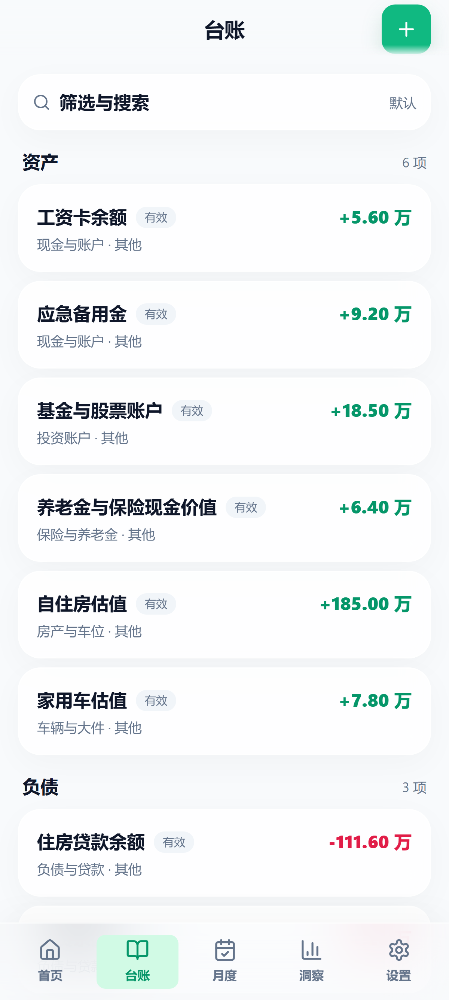
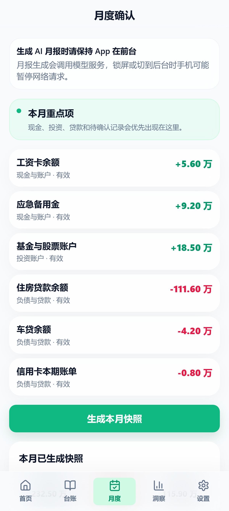
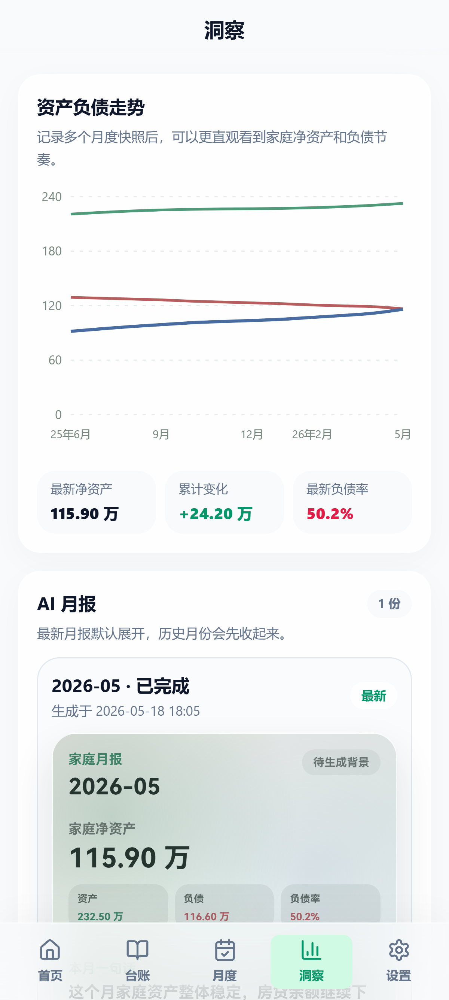
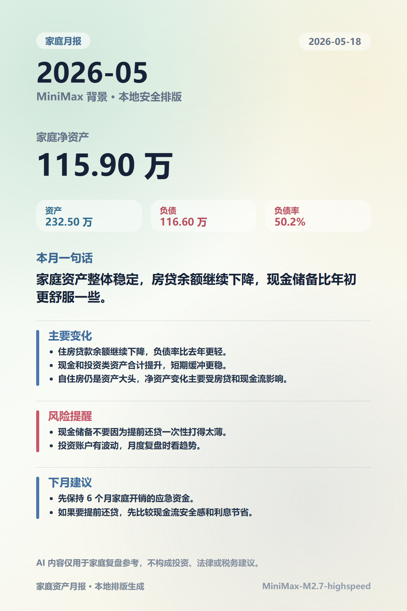
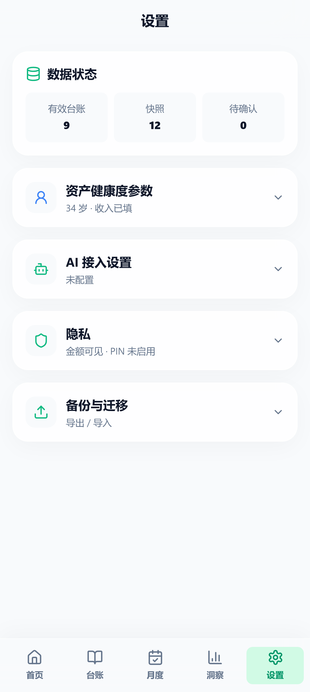

# 为了让家里少一点财务焦虑，我做了一个家庭资产台账 App

这几年，我越来越觉得，很多家庭的财务焦虑并不完全来自“钱不够多”，也来自“看不清”。

背上房贷以后，这种感觉会特别明显。

每个月收入进来，很快又被房贷、日常开销、保险、孩子、父母、人情往来分走。好不容易攒下一点现金，又会纠结要不要提前还房贷。提前还了，负债是少了，但手里的现金流又变薄了；不还，好像又总觉得背着债。

我妻子就会因此焦虑。

所以一开始，我只是想做一件很朴素的事：把家里的资产和负债梳理清楚，看看家庭净资产到底是多少，房贷压力到底有多大，手里的现金是不是太少。

不是为了做什么投资决策，也不是为了算得多精确。

只是希望一家人能从“凭感觉担心”，变成“摊开来看一眼”。

## 从 Excel 开始

最早的时候，我是在金山 WPS 云文档里建了一个共享 Excel。

里面列着银行卡、现金、基金、房子、车、房贷、公积金贷款这些项目。大概每三个月更新一次，看看总资产、总负债和净资产有没有变化。

这个方法能用，但比较麻烦。

每次更新都要复制旧表、改金额、检查公式。手机上看也不算顺手。时间一久，维护成本就会变高。

后来 AI 发展很快，我用 TRAE 先搓了一个 Web 版自己用。Web 版比 Excel 方便一点，但它毕竟还是更适合电脑。

家庭资产这种东西，很多时候是坐在沙发上、睡前、或者突然想起来时打开手机看一眼。手机端才是更自然的使用场景。

再后来，我又做了一个微信小程序版本，还认证上线了一段时间。也花了几十块钱，但没有发群、没有推广，一个月只有二十几个人点击。后来我想了想，既然主要是本地自用，数据也不需要上云，那为什么不直接做成本地 Android App 呢？

于是就有了现在这个版本。

## 它不是记账软件

说明一下：下面所有产品截图和月报图片都使用虚构测试数据，只用于展示 App 功能和界面效果，不代表我的真实家庭资产情况，也不构成任何财务建议。

我给它的定位不是“记账软件”。

它更像一本放在手机里的家庭资产簿。

记账软件通常关注每天花了多少钱，今天买菜、吃饭、打车、订阅会员分别花了多少。这个 App 关注的是另一件事：家庭现在到底有多少资产、多少负债、净资产是多少、负债率有没有下降、现金流是不是太紧。

所以它不要求每天打开。

我的理想使用方式是：每个月只更新一次需要变动的项目，比如现金、基金、股票、房贷余额、车贷余额。像房子、车、长期保险这类不常变的项目，可以保持不动。

更新完以后，生成一个月度快照。

这样时间拉长以后，就能看到家庭资产负债的变化趋势。

## 每月做一次家庭资产快照

现在这个版本里，我把核心流程简化成了“月度确认”。

每个月打开一次，重点确认那些经常变化的项目：

- 现金和银行卡余额
- 投资账户市值
- 房贷、车贷等贷款余额
- 需要确认是否结束的记录

确认完以后，生成本月快照。

快照会记录当月的总资产、总负债、净资产、负债率和分类结构。以后回头看，不需要翻一堆表格，也不用担心哪次复制错了公式。

## 看趋势，比看单个数字更重要

我自己使用下来，觉得最有价值的不是某一个数字，而是趋势。

比如：

- 净资产是不是在缓慢变多
- 负债是不是在一点点下降
- 现金储备是不是总是太薄
- 房产是不是占了资产的大头
- 投资类资产是不是波动太大

很多焦虑来自单点数字。

但趋势能让人平静一点。

如果这个月现金少了一点，但房贷下降了，净资产还在往上走，就没有必要过度紧张。如果负债率下降了，但现金储备被提前还贷打得很薄，那下个月的重点就不是继续还贷，而是先把流动性补回来。

这也是我做这个 App 的初衷：不是让它替家庭做决定，而是让家庭有一个更清楚的复盘入口。

## 加了一点 AI，但不会直接替你入账

这个版本也加了 AI 功能。

目前我接入的是 MiniMax，主要做两件事：

第一，AI 快速记。比如输入一段自然语言：“新增一笔共同的微信零钱 1.2 万，还有一笔住房贷款剩余 57.1 万。”AI 会帮忙拆成待确认记录，并自动分配分类。

第二，AI 月报。生成月度快照以后，可以让 AI 根据脱敏后的资产摘要，写一份家庭资产月报，帮你总结主要变化、风险提醒和下月建议。

但这里我做了几个限制：

- AI 生成的记录不会直接入账，只会先进待确认列表
- AI 月报只用于家庭复盘，不提供具体投资建议
- API Key 保存在本机安全存储里，不进入备份文件
- 台账数据默认保存在本机，不做云同步
- 如果启用 AI 功能，需要自己确认所选模型服务是否适合处理个人财务信息

我对这个工具的期待很简单：AI 可以帮忙整理和表达，但真正的家庭财务判断，仍然应该由人来做。

## 为什么坚持本地优先

家庭资产数据太私密了。

很多人可能愿意把日常消费记到云端，但未必愿意把房产、贷款、现金、投资账户、家庭净资产这些信息交给在线服务。

所以这个 Android 版本默认是本地优先：

- 台账数据保存在本机
- 备份需要手动导出
- 没有账号登录
- 没有云同步
- 支持隐藏金额和启动保护
- AI 密钥单独保存，不写入备份

这也意味着它不是一个“大而全”的商业产品。

它更像一个面向自用、小范围试用、以及同样有类似需求的人开放的工具。

## 适合谁

我觉得它比较适合这些人：

- 已经背上房贷，想看清家庭资产负债的人
- 不想每天记账，但愿意每月复盘一次的人
- 想知道家庭净资产变化趋势的人
- 想把资产和负债放在同一张表里管理的人
- 不希望家庭财务数据默认上云的人
- 想用 AI 帮忙生成月报，但仍然希望自己掌握数据的人

它不适合这些场景：

- 想做每天消费流水记账
- 想自动同步银行账户
- 想获得投资推荐
- 想多人在线协作
- 想要完整商业级云服务

## 项目地址

项目已经放在 GitHub：

https://github.com/XiaoLi1991-star/home-finance

目前主要目标是 Android 本地版。它是我从 Excel、Web、小程序一路迭代过来的版本，也是目前最符合我自己家庭使用习惯的版本。

如果你也有类似的家庭资产整理需求，可以看看源码，也欢迎提建议。

最后还是要强调一下：这个项目只是用于个人和家庭资产整理，不构成投资、理财、税务或法律建议。所有评分和 AI 月报都只能作为辅助参考，真正的家庭财务决策仍然需要自己判断。
